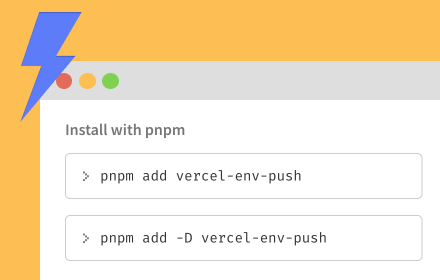

  <h1>npm-package-manager-extension</h1>
  
Multiple package managers support for npmjs.com

  

    
  

  
  
    

A Chrome and Edge browser extension adding support for multiple package managers to [the npmjs.com registry](https://www.npmjs.com).

## Features

- Support for multiple package managers:
  - [npm](https://docs.npmjs.com/cli)
  - [yarn](https://yarnpkg.com/)
  - [pnpm](https://pnpm.io/)
  - [ni](https://github.com/antfu/ni)
  - [bun](https://bun.sh/)
- Display both the command to install a package as dependency or development dependency.
- Display an extra command to install TypeScript declarations for packages having external declarations.
- Remove the layout shift of the entire page when copying a command.
- Pin the sidebar so it is always visible even when scrolling down long package descriptions.

## Installation

You can install the extension directly from the [Chrome Web Store](https://chrome.google.com/webstore/detail/npm-package-manager/mkflcfbfnijaofdeeflecnjlooefmcka) or the [Microsoft Edge Add-ons Marketplace](https://microsoftedge.microsoft.com/addons/detail/npm-package-manager/oogocgnfebpilcfmlgdencdmemicdaoo).

## License

Licensed under the MIT License, Copyright © HiDeoo.

See [LICENSE](https://github.com/HiDeoo/npm-package-manager-extension/blob/main/LICENSE) for more information.
